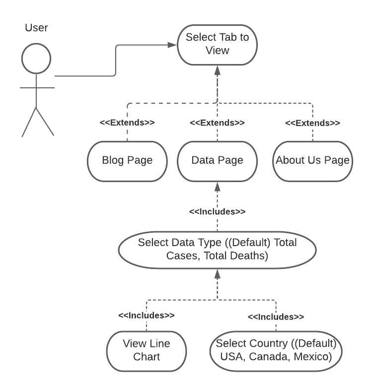

# DataTitans

## Description of Prototype
1. The Home page shows the data in the form of charts. From all pages, users can navigate to Data (Home), About, and Blog pages from the menu at the top of the screen.
2. The Data page will allow users to choose from dropdown lists for Country (USA-default, Canada, Mexico), Data Type (total cases-default, total deaths) and Chart Type (line).
3. Charts will show the selected data for all dates in the COVID-19 data from [Our World in Data](https://ourworldindata.org/) as of the latest download.
4. The About page will show a brief description of the website (Our Goal) as well as short bios of the team members.
5. Users can view the Blog page to read about the future of the site. The initial blog post will include specifications for the completed project.
6. Charts are built with a downloaded json file from which panda dataframes are created and visualized through the seaborn library.
7. Remaining web elements are built with HTML.
8. The charts and data should be accessible by the latest browsers (i.e Firefox, Chrome, Safari)

## Use Case Diagram

## Getting Started

In order to set up and run the project you will need to have [Python 3.8](https://www.python.org/downloads/) and [Django 3.1.1](https://www.djangoproject.com/download/) or later installed.

### Installing Python
You can either install python directly on your machine or use a python engine such as [Anaconda](https://www.anaconda.com/products/individual).
It is advised to run Python inside a virtual environment.

### Installing Django
1. Run `python -m pip install --upgrade pip`
2. Run `pip install -r requirements.txt`. This will install the required packages.

### Running Migrations
To ensure that all members' database is up to date and avoid migration errors,
run the following command whenever a change has been made to the database or, to be safer,
whenever you pull a new version of the project from github.

1. Run `python manage.py makemigrations`
2. Run `python manage.py migrate`

## Running the Web Server
There are two options you can take to run the server, either:
1. Inside the datatitans directory, where `manage.py` is, run `python manage.py migrate`. This sets up the database.
(Currently SQLite)
2. Run `python manage.py runserver`

or

1. run `python manage.py run` this is a custom command that will run the migrations and the server

## Adding blog posts

### Creating an admin user
1. In the datatitan_site run `python manage.py createsuperuser`
2. Enter, email, username and password (don't forget them)

### Add blog post
1. Run web server
2. Navigate to the url: `127.0.0.1/admin`
3. Enter the user name and password
4. On the admin page click the "+Add" button next to Posts 

5. Add Author, title and text of the blog.

6. You can save and continue later (do not fill out publish date info or choose a future date),
and when ready to publish just click the now and today buttons under the 'Publish date' form item.

## Known Issues
1. You may need to run the server twice the first time,
as the tables may not have been fully initialized when the server first starts up.
2. Accounts and posts are specific to the machine the server is being run on.
Technically, the covid data is also machine-specific, but the server automatically downloads updates to the data.
3. At the moment, the only host allowed by the site is `127.0.0.1`.
Attempting to connect to the server through `localhost` WILL fail.
We could add `localhost` to the list of allowed hosts, but it isn't currently a priority.
