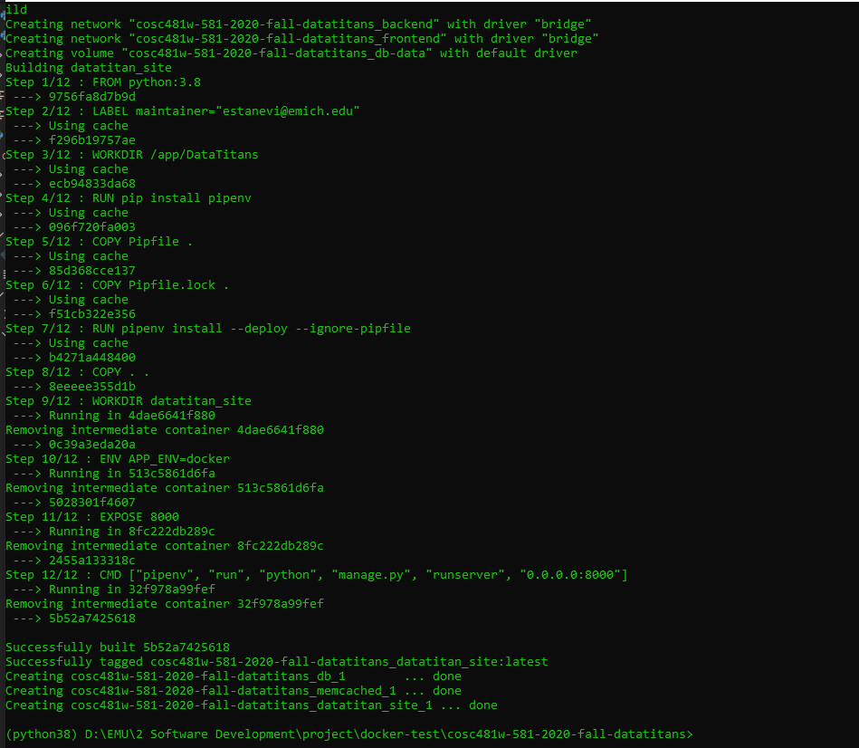
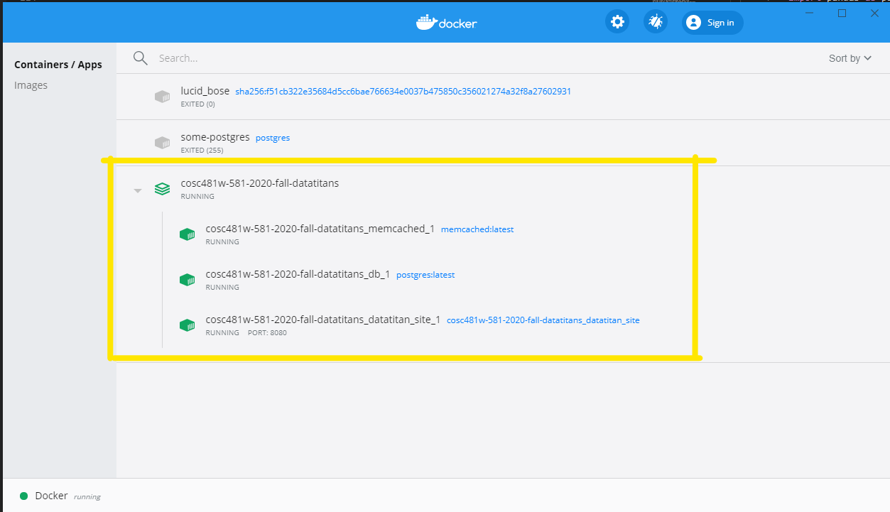

# DataTitans

## Description of Prototype
1. The Home page shows the data in the form of charts. From all pages, users can navigate to Data (Home), About,
and Blog pages from the menu at the top of the screen.
2. The Data page will allow users to choose from dropdown lists for Country (USA-default, Canada, Mexico),
Data Type (total cases-default, total deaths) and Chart Type (line).
3. Charts will show the selected data for all dates in the COVID-19 data from
[Our World in Data](https://ourworldindata.org/) as of the latest download.
4. The "About" page will show a brief description of the website (Our Goal) as well as short bios of the team members.
5. Users can view the Blog page to read about the future of the site.
The initial blog post will include specifications for the completed project.
6. Charts are built with a downloaded json file from which panda dataframes are created
and visualized through the seaborn library.
7. Remaining web elements are built with HTML.
8. The charts and data should be accessible by the latest browsers (i.e Firefox, Chrome, Safari)

## Use Case Diagram

## Persona

### Fred: The debating enthusiast

### Screening Questions
1. What do you think about the pandemic?
2. Where do you live?
3. What is your daily routine?
4. What sources of information do you currently use to get COVID news/information?
5. Are daily updates of the pandemic critical to your work?

Fred has lived in Ypsilanti Michigan his whole life.
He lives with his wife, 3 year old daughter and pet dog Dino.
Every weekend he would either spend the day with his family at the park or with his friends at a local restaurant
having debates about current events.
Once the pandemic caused a lockdown, Fred found himself spending a lot more time at home.
With the exception of taking the dog for walks and getting emergency groceries,
a lot of his time is now spent in the living room, also known as the makeshift preschool, with his daughter.

Fred’s wife works as a general physician, and while she does not directly interact with covid patients,
she gets a glimpse of the front lines daily and tells her husband about it after work.
Their daughter had just started preschool before the pandemic arrived but now learns from home from her dad.
She is quite happy about this.

Even though Fred lost his job, he is not immediately worried about money to sustain his family.
He and his wife have a backup saving account for just such an occasion,
although he is worried about how long the pandemic will last, and is constantly following the trends.

A lot of Fred’s social activities have turned into virtual ones, and he has relied on webex to facilitate them.
Current events are still the topic that he and his friends debate on
since the lockdown has been almost exclusively about COVID.
His friends argue that they should go out and meet up more to help avoid more devastating news,
like their favourite restaurant closing down.
He tries to argue against it using articles he reads in the paper and announcements on the television
but is usually dismissed because “those articles are serving a political agenda” some of his friends would say.

Thinks: If he had other sources of data that were unbiased and visual, he would win all the debates with his friends.

Sees: He sees the negative effects that the quarantine has had when he takes his dog for walks,
he however also knows the far worse consequences if the safety measures were ignored.

Feels: Remorse for people who lost their businesses and jobs. (Himself being one of them)

Does: Fred looks up statistics every morning before his wife goes for work
and reads a more detailed article later in the afternoon.

## Problem Scenario

1. To obtain quick, accurate, up-to-date COVID data for Michigan and the Ypsilanti area
with an easy-to-use visual representation.
2. Currently, Fred doesn't have a single location to find all the information he is looking for.
As a result, he spends quite a bit of time browsing several other sites
(eg. Michigan COVID dashboard, Twitter, Google, and news media)
3. Ideally, our site provides access to global, national, and even local data.
It also has visual, clickable links to enable Fred to drill down for more specific results.
Lastly, it will have an aggregator for relevant articles and other news sources.

## Getting Started

In order to set up and run the project you will need to have [Python 3.8](https://www.python.org/downloads/) and [Django 3.1.1](https://www.djangoproject.com/download/) or later installed.

### Installing Python
You can either install python directly on your machine or use a python engine such as [Anaconda](https://www.anaconda.com/products/individual).
It is advised to run Python inside a virtual environment.

### Installing Django
1a. Run `python -m pip install --upgrade pip`
OR
1b. pipenv install
(** NOTE: pipenv is preferred)

2. Run `pip install -r requirements.txt`. This will install the required packages.

### Running Migrations
To ensure that all members' database is up to date and avoid migration errors,
run the following command whenever a change has been made to the database or, to be safer,
whenever you pull a new version of the project from github.

1. Run `python manage.py makemigrations`
2. Run `python manage.py migrate`

## Running the Web Server
There are two options you can take to run the server, either:
1. Inside the datatitans directory, where `manage.py` is, run `python manage.py migrate`. This sets up the database.
(Currently SQLite)
2. Run `python manage.py runserver`

or

1. run `python manage.py run` this is a custom command that will run the migrations and the server

## Going the Docker route
If you are inclined, you can run the project using docker. Docker sets up a virtual container that holds an instance of the django project, as well as an instance of a postgres database. In order to set this up and get it running, follow these steps:

### 1. Installing Docker
* Download docker desktop from https://www.docker.com/products/docker-desktop.
* Follow the installation wizard to set up docker
* Once docker is installed, create a password file called `postgres_password.txt` on the `datatitans/cred/` directory. This will hold the postgres instance password. Simply make any password.
* At this stage you should be ready to start up the docker container.

### 2. Starting up the docker container
* Open your terminal and navigate to the `cosc481w-581-2020-fall-datatitans` directory.
* Run `docker-compose up -d --build` This will create a container with a copy of the current version of the project. Once it is finished you should have a similar terminal screen

And your docker desktop application should look like this. One container named, with 3 images below

* Hover over the image ending in `datatitan_site_1` and select the cli button. This will open up a new terminal

* Inside the terminal run `pipenv shell` and `cd datatitan_site`
* Run migration, `python manage.py migrate`
* Run `python manage.py populatedata` to update the database
* You should now be able to run `python manage.py runserver 0.0.0.0:8080` to start up the server. Note that the port is now 8080 to avoid conflict with your regular django setup. Accessing the site in the browser will be at `127.0.0.1:8080`.
* Another note: it may take a little while to connect.

### 3. Closing the docker container
In order to close the container once done working on the site, run the following command:

* In your regular terminal, in the `cosc481w-581-2020-fall-datatitans` directory, run `docker-compose down`. This will close and remove the container.
* To start the project up again, repeat process from step 2: Starting up the docker container 

## Adding blog posts

### Creating an admin user
1. In the datatitan_site run `python manage.py createsuperuser`
2. Enter, email, username and password (don't forget them)

### Add blog post
1. Run web server
2. Navigate to the url: `127.0.0.1/admin`
3. Enter the user name and password
4. On the admin page click the "+Add" button next to Posts 

5. Add Author, title and text of the blog.

6. You can save and continue later (do not fill out publish date info or choose a future date),
and when ready to publish just click the now and today buttons under the 'Publish date' form item.

## Accessing AWS server via PuTTY SSH 

These instructions detail how to access our AWS server via PuTTY. 

Notes: 
•	Currently, the user information is for Chisulo’s account. If others are going to be working with AWS, we will need to create our own IAM accounts. 

•	For now, we will continue to do all project edits through GitHub. So we only need to access the AWS server to upload working releases. 

### Instructions:

If you do not have PuTTY installed, you can download it here: 
https://www.chiark.greenend.org.uk/~sgtatham/putty/latest.html 

Before starting PuTTY, download the authentication key here: 
https://drive.google.com/file/d/1JcfkE_vzwfANi76w5tOlJ-426tpZrVQG/view?usp=sharing 

Open PuTTY, you will see the Configuration screen (Image 1):
 

Per Image 1, with Session selected in the Category column on the left:
1. For Host Name, enter:
  o	 ec2-54-174-95-142.compute-1.amazonaws.com
2. Port: enter 22 if it’s not defaulted
3. Connection type: choose the SSH radio button

 
Image 2: 
 

Per Image 2, select Auth in the Category column and:
1. Confirm that the boxes are checked as shown
2. Browse for the key you downloaded above and confirm the path is showing

 
Image 3:
 

Per Image 3, choose Connection from the Category menu:
1. Enter 60 in the Seconds between keepalives field

 
Image 4:
 

Per Image 4, after clicking on Session again:
1. Type in a session name (in Saved Sessions window): DT2 used in example
2. Click on the Open button
This should open a terminal window. At the login prompt, type: ec2-user
No password is required.
To run server in the background:

Type "exit" to quit

## Runnning Django in the background on AWS

1. Login in to AWS Server

### Activate virtual environment

1. cd into `site` directory
2. Run `source django/bin/activate`

### Run server in background

1. cd into datatitan_site directory
2. run `screen`. This creates a new terminal screen. 
3. run `python manage.py runserver 0.0.0.0:8000`
4. type `Ctrl + a` then `Ctrl + d` if on Windows. `Cmd + a` then `Cmd + d` on Mac. Running this will detach the screen from your terminal sesssion so it can continue to run even when you disconnect from the server.
5. (optional) to do all this in 1 step, run `screen -d -m python manage.py runserver 0.0.0.0:8000`

### Stopping the server

1. run `screen -r`. This will re-attach the screen the server is running on
2. close the server as normal, `Ctrl + c`

## Known Issues
1. You may need to run the server twice the first time,
as the tables may not have been fully initialized when the server first starts up.
2. Accounts and posts are specific to the machine the server is being run on.
Technically, the covid data is also machine-specific, but the server automatically downloads updates to the data.
3. At the moment, the only host allowed by the site is `127.0.0.1`.
Attempting to connect to the server through `localhost` WILL fail.
We could add `localhost` to the list of allowed hosts, but it isn't currently a priority.
